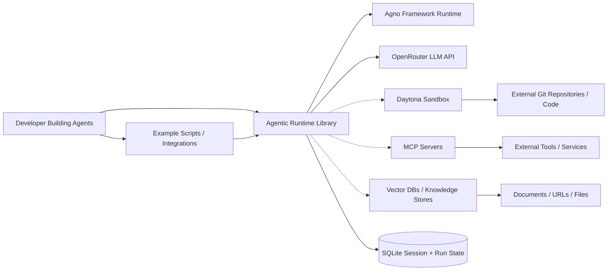
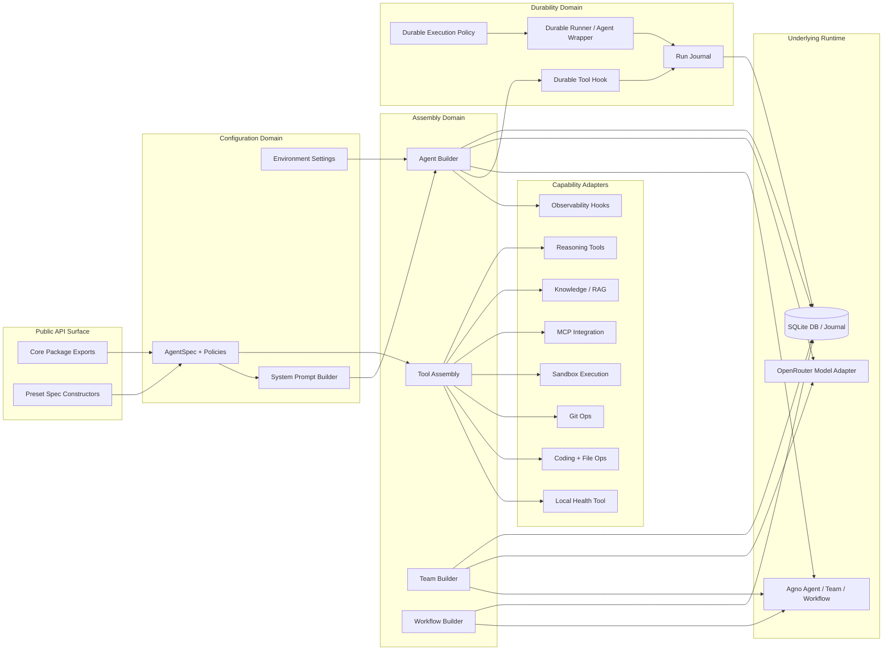
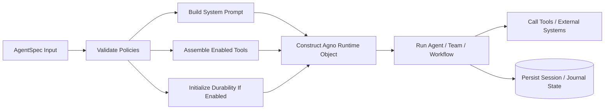

# Codebase Diagram

This document gives an executive-friendly view of how `agentic-runtime` is organized, how its major runtime pieces interact, and where those concepts live in the repository.

## Legend

- Rounded boxes represent runtime components or code domains.
- Cylinders represent persisted storage.
- Solid arrows represent primary runtime calls or data flow.
- Dashed arrows represent optional integrations that are enabled by policy.

## System Context Diagram

### Code anchors

- `pkg_runtime` -> `core/__init__.py`, `core/factory.py`
- `ex_samples` -> `examples/01_basic_agent.py`, `examples/09_agentic_coding_agent.py`, `examples/10_xlsx_skill_agent.py`
- `agno_core` -> `core/factory.py:11`, `core/factory.py:14`, `core/factory.py:16`
- `openrouter_llm` -> `core/factory.py:13`, `core/settings.py:8`
- `daytona_sandbox` -> `core/tools/daytona.py`, `core/policies.py:51`
- `mcp_servers` -> `core/tools/mcp.py`, `core/policies.py:81`
- `vector_store` -> `core/tools/knowledge.py`, `core/policies.py:133`
- `sqlite_state` -> `core/factory.py:41`, `core/durability/journal.py`
- `ext_repo` -> `examples/09_agentic_coding_agent.py`

## Codebase Architecture Diagram

### Code anchors

- `api_exports` -> `core/__init__.py`
- `api_presets` -> `core/policies.py:603`, `core/policies.py:698`, `core/policies.py:737`
- `cfg_spec` -> `core/policies.py`
- `cfg_settings` -> `core/settings.py`
- `cfg_prompts` -> `core/prompts/system.py`
- `fac_tools` -> `core/factory.py:47`
- `fac_agent` -> `core/factory.py:141`
- `fac_team` -> `core/factory.py:277`
- `fac_workflow` -> `core/factory.py:347`
- `tool_local` -> `core/tools/local.py`
- `tool_coding` -> `core/tools/coding.py`
- `tool_git` -> `core/tools/git.py`
- `tool_daytona` -> `core/tools/daytona.py`
- `tool_mcp` -> `core/tools/mcp.py`
- `tool_knowledge` -> `core/tools/knowledge.py`
- `tool_reasoning` -> `core/tools/reasoning.py`
- `tool_hooks` -> `core/tools/hooks.py`
- `dur_policy` -> `core/durability/policy.py`
- `dur_hook` -> `core/durability/hooks.py`
- `dur_runner` -> `core/durability/runner.py`, `core/durability/agent.py`
- `dur_journal` -> `core/durability/journal.py`
- `runtime_agno` -> `core/factory.py:11`, `core/factory.py:14`, `core/factory.py:16`
- `runtime_model` -> `core/factory.py:13`
- `runtime_db` -> `core/factory.py:41`, `core/durability/journal.py:26`

## Request and Build Lifecycle

### Code anchors

- `input_spec` -> `core/policies.py`
- `validate_policy` -> `core/policies.py`, `tests/test_policies.py`
- `build_prompt` -> `core/prompts/system.py`
- `assemble_tools` -> `core/factory.py:47`
- `init_durability` -> `core/factory.py:161`, `core/durability/runner.py`
- `create_agent` -> `core/factory.py:141`, `core/factory.py:277`, `core/factory.py:347`
- `run_agent` -> `examples/01_basic_agent.py`, `examples/08_multi_agent_team.py`
- `use_integrations` -> `core/tools/daytona.py`, `core/tools/mcp.py`, `core/tools/knowledge.py`
- `persist_state` -> `core/factory.py:44`, `core/durability/journal.py`

## Architectural Notes

- The repository is centered on a single configuration model, `AgentSpec`, which controls which runtime capabilities are assembled.
- `core/factory.py` is the orchestration hub: it translates policy objects into Agno `Agent`, `Team`, and `Workflow` instances.
- Tooling is modularized by capability under `core/tools/`, with each file exposing a builder that the factory composes.
- Durability is a distinct subdomain under `core/durability/`, layered on top of normal agent execution rather than mixed into each tool implementation.
- Examples act as the main executable entrypoints for humans evaluating the package; there is no first-class HTTP API server in this repository today.

## Unknowns / Assumptions

- No production deployment topology is documented in the repo; the diagrams assume this project is primarily a Python library plus runnable examples.
- `fastapi` and `uvicorn` are installed in `pyproject.toml`, but no application server entrypoint was found in `core/` or `examples/` during inspection.
- The exact behavior of `core/durability/hooks.py` was inferred from factory wiring and neighboring durability modules; verify with `core/durability/hooks.py` if you need a more detailed checkpoint/resume sequence diagram.
- To verify whether an API or worker layer exists outside the inspected paths, run: `rg --line-number --hidden --glob '!.git' "FastAPI\(|APIRouter\(|@app\.|Celery|RQ|dramatiq|schedule" .`
- To verify all exported preset constructors and policy defaults, inspect the lower half of `core/policies.py` and `tests/test_factory.py`.
